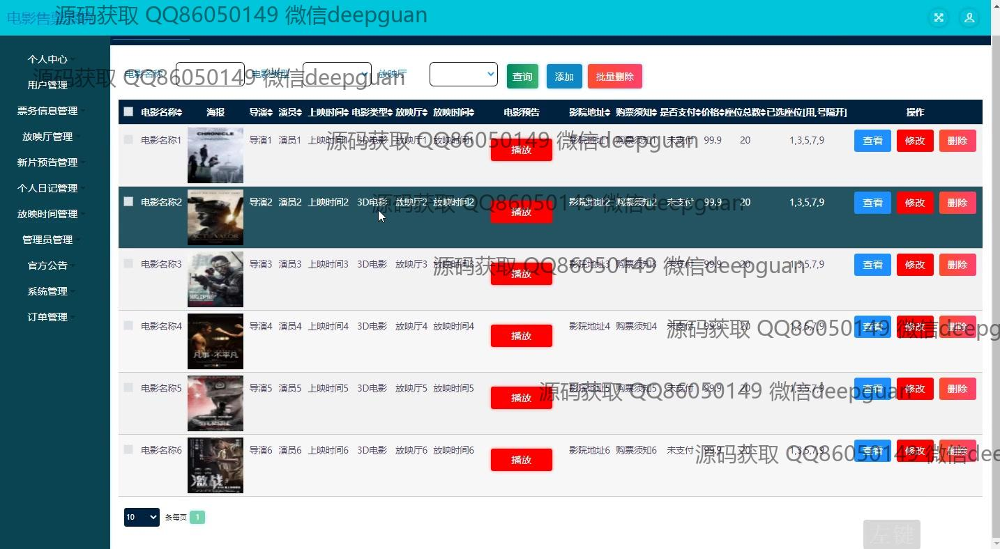

<h1 align="center">的电影售票系统</h1>

## 简介
电影售票系统：角色分为管理员、用户；提供用户注册、登录、电影信息管理、票务信息管理、订单管理、后台管理等功能，支持在线客服和用户互动。    --计算机毕业设计源码；毕设源码；java毕业设计源码

## 联系方式

<h3 align="center">获取完整代码与数据库文件 + 微信：deepguan QQ: 86050149 QQ群: 783742310</h3>

<h3 align="center">可帮忙远程部署 包运行成功！提供远程部署、修改代码、设计文档指导、代码讲解等服务！</h3>

## 功能介绍（完整见运行截图）
管理员：基本功能包括登录、注册和退出。系统首页提供票务信息、新片预告及其他管理功能模块的访问。支持电影信息管理，可以输入电影名称、导演和演员信息，上传电影海报，选择电影类型和上映时间，管理放映厅及放映时间。提供订单管理，包括查看订单状态、数量和总价，支持对放映厅、用户和票务信息进行全面管理。用户：用户可通过登录界面安心、便捷地进入系统，进行个人资料的更新和管理。可以查看电影详情，例如海报、价格、上映时间和地点，支持在线购票和座位选择。订单界面允许用户查看历史订单，管理订单状态如未支付、已发货等，并提供在线客服功能。用户中心包括个人信息查看与修改、订单查询、我的收藏等功能，提升用户体验。

## 运行截图

本代码来源于网络,仅供学习参考使用!

